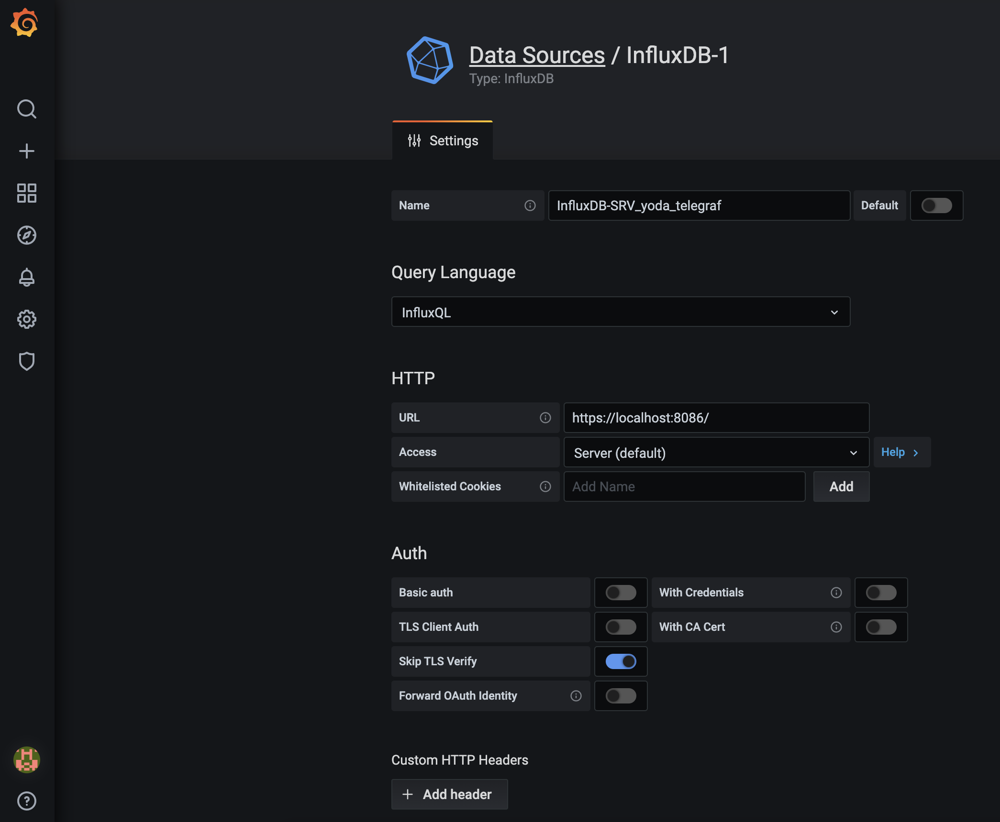
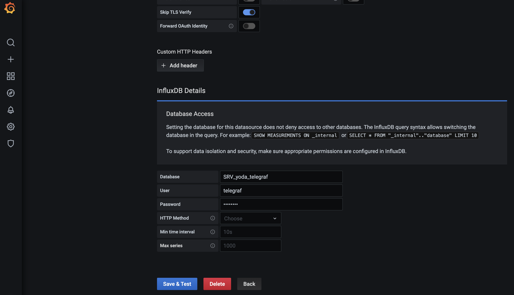
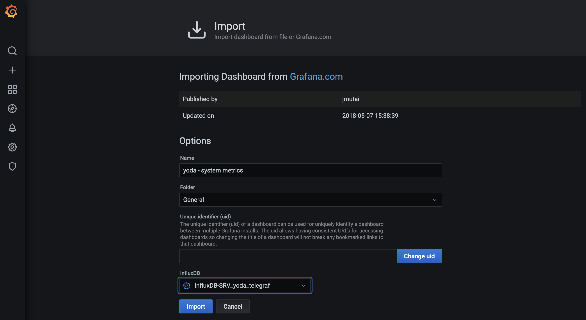
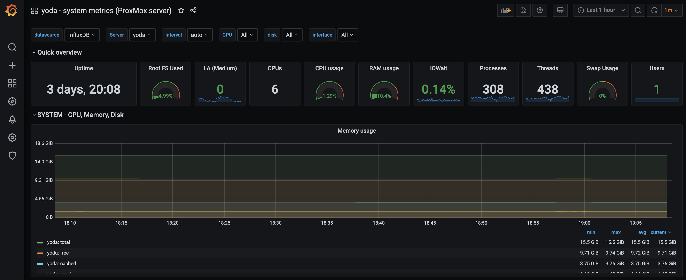
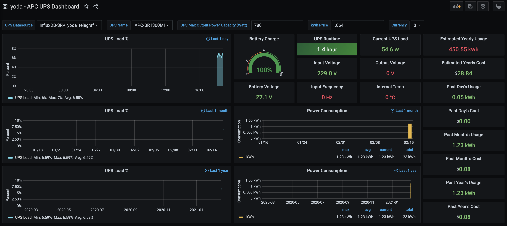

# Create InfluxDB database to hold Telegraf data incoming from the server that has the UPS connected and apcupsd running


## Menu?

- We will install Telegraf in a server that is connected to an APC UPS (already running ***apcupsd***) and push data to our already running InfluxDB database in our stats server (in this case called "***stats1***").
- This set up asumes that you already have your monitoring server (*stats1*) with InfuxDB and Grafana up and running.
- Will use Telegraf to gather data on yoda's system metrics.
- Will use Telegraf to gather data on our APC UPS metrics.
- Also asumes that apcupsd is already up and running in the server you have the UPS connected (in this case called "***yoda***").
- Will set up two new dashboards in our Grafana service in order to display yoda's system metrics and the UPS metrics.


This set up asumes that you already have your monitoring server with InfuxDB and Grafana up and running.

> **My server (where I have InfuxDB and Grafana istalled and running) is called "*stats1*" and it has a fixed IP address *10.0.1.25/24*.**


**To go though that required previos set up, you may have a look at: [TIG](https://65007.github.io/TIG/)**


## Create a new Telegraf database in your statistics server

> In my case this is *stats1* server, where I already have InfluxDB and Grafana up and running.

```
# influx -ssl -unsafeSsl
```

Will create a database called "SRV_yoda_telegraf" (where yoda is the name of the server connected to the UPS).

> You may choose any name you want but write it down 'cos you'll need it later.

```
Connected to https://localhost:8086 version 1.8.4
InfluxDB shell version: 1.8.4
> show databases
name: databases
name
----
_internal
telegraf
> create database SRV_yoda_telegraf
> show users
user   admin
----   -----
telegraf false
> show databases
name: databases
name
----
_internal
telegraf
SRV_yoda_telegraf
> quit
```


Find out the OS version I'm running

```
root@yoda:~# cat /etc/os-release 
PRETTY_NAME="Debian GNU/Linux 10 (buster)"
NAME="Debian GNU/Linux"
VERSION_ID="10"
VERSION="10 (buster)"
VERSION_CODENAME=buster
ID=debian
HOME_URL="https://www.debian.org/"
SUPPORT_URL="https://www.debian.org/support"
BUG_REPORT_URL="https://bugs.debian.org/"
```


Add repositories to be able to install telegraf

First add the repositories key

```
curl -sL https://repos.influxdata.com/influxdb.key | apt-key add -
```

Then add the repository

```
# echo "deb https://repos.influxdata.com/{DISTRIB_ID} {DISTRIB_CODENAME} stable" | tee /etc/apt/sources.list.d/influxdb.list
```

Where {DISTRIB_ID} is "debian" and {DISTRIB_CODENAME} is "buster"

So you should end up with the following file and content

```
root@yoda:/etc/telegraf# more /etc/apt/sources.list.d/influxdb.list 
deb https://repos.influxdata.com/debian buster stable
```


Update packages

```
root@yoda:~# apt-get update

Get:1 http://security.debian.org buster/updates InRelease [65.4 kB]
Hit:2 http://ftp.debian.org/debian buster InRelease                                                               
Get:3 http://ftp.debian.org/debian buster-updates InRelease [51.9 kB]
Get:4 http://security.debian.org buster/updates/main amd64 Packages [267 kB]
Get:5 https://repos.influxdata.com/debian buster InRelease [4,737 B]                        
Get:6 http://download.proxmox.com/debian/pve buster InRelease [3,051 B]
Get:7 https://repos.influxdata.com/debian buster/stable amd64 Packages [1,065 B]
Get:8 http://download.proxmox.com/debian/pve buster/pve-no-subscription amd64 Packages [340 kB]
Fetched 733 kB in 2s (350 kB/s)   
Reading package lists... Done
```


## Install telegraf

```
root@yoda:~# apt install telegraf -y

Reading package lists... Done
Building dependency tree       
Reading state information... Done
The following NEW packages will be installed:
  telegraf
0 upgraded, 1 newly installed, 0 to remove and 5 not upgraded.
Need to get 22.3 MB of archives.
After this operation, 74.0 MB of additional disk space will be used.
Get:1 https://repos.influxdata.com/debian buster/stable amd64 telegraf amd64 1.17.2-1 [22.3 MB]
Fetched 22.3 MB in 3s (7,955 kB/s)  
Selecting previously unselected package telegraf.
(Reading database ... 51041 files and directories currently installed.)
Preparing to unpack .../telegraf_1.17.2-1_amd64.deb ...
Unpacking telegraf (1.17.2-1) ...
Setting up telegraf (1.17.2-1) ...
Created symlink /etc/systemd/system/multi-user.target.wants/telegraf.service → /lib/systemd/system/telegraf.service.
```


After the installation is complete, start the telegraf service and enable it to launch everytime at system startup:

```
# systemctl start telegraf
# systemctl enable telegraf
```


Go to the ‘/etc/telegraf’ directory and rename the default configuration file:

```
# cd /etc/telegraf/
# mv telegraf.conf telegraf.conf.default
```

Now create a new other configuration ‘telegraf.conf’ using nano editor:

> Make sure you review and edit the configuration below according to your desired system config. In particular you should edit the "hostname" parameter in the "agent" and the “## HTTP Basic Auth” parameters in the “Output Pluggins section” part incase you picked a diffrerent password or database name for your InfluxDB Telegraf database.
> As for the rest, you may leave it as it is and yes, it should work !

```
nano telegraf.conf
```

```
# Configuration for telegraf agent
[agent]
	hostname = "yoda"
	flush_interval = "15s"
	interval = "15s"

###############################################################################
# OUTPUT PLUGINS
###############################################################################

# Configuration for sending metrics to InfluxDB
[[outputs.influxdb]]
	## The full HTTP or UDP URL for your InfluxDB instance.
	##
	## Multiple URLs can be specified for a single cluster, only ONE of the
	## urls will be written to each interval.
	urls = [ "https://10.0.1.25:8086" ]

	## The target database for metrics; will be created as needed.
	## For UDP url endpoint database needs to be configured on server side.
	database = "SRV_yoda_telegraf"

	## HTTP Basic Auth
	username = "telegraf"
	password = "t313graf"


###############################################################################
# PROCESSOR PLUGINS
###############################################################################


###############################################################################
# AGGREGATOR PLUGINS
###############################################################################


###############################################################################
# INPUT PLUGINS
###############################################################################

# Read metrics about cpu usage
[[inputs.cpu]]
	## Whether to report per-cpu stats or not
	percpu = true
	## Whether to report total system cpu stats or not
	totalcpu = true
	## If true, collect raw CPU time metrics
	collect_cpu_time = false
	## If true, compute and report the sum of all non-idle CPU states
	report_active = false

# Read metrics about disk usage by mount point
[[inputs.disk]]
	## By default stats will be gathered for all mount points.
	## Set mount_points will restrict the stats to only the specified mount points.
	# mount_points = ["/"]

	## Ignore mount points by filesystem type.
	ignore_fs = ["tmpfs", "devtmpfs", "devfs"]

# Get kernel statistics from /proc/stat
[[inputs.kernel]]

# Read metrics about memory usage
[[inputs.mem]]

# Get the number of processes and group them by status
[[inputs.processes]]

# Read metrics about swap memory usage
[[inputs.swap]]

# Read metrics about system load & uptime
[[inputs.system]]
	## Uncomment to remove deprecated metrics.
	# fielddrop = ["uptime_format"]

# Read metrics about network interface usage
[[inputs.net]]
	## By default, telegraf gathers stats from any up interface (excluding loopback)
	## Setting interfaces will tell it to gather these explicit interfaces,
	## regardless of status.
	##
	# interfaces = ["eth0"]
	##
	## On linux systems telegraf also collects protocol stats.
	## Setting ignore_protocol_stats to true will skip reporting of protocol metrics.
	##
	# ignore_protocol_stats = false

# Read TCP metrics such as established, time wait and sockets counts.
[[inputs.netstat]]

# Read metrics about IO
[[inputs.io]]

# # Monitor APC UPSes connected to apcupsd
[[inputs.apcupsd]]
        ## A list of running apcupsd server to connect to.
        ## If not provided will default to tcp://127.0.0.1:3551
        #servers = ["tcp://127.0.0.1:3551"]
        ##
        ## Timeout for dialing server.
        #timeout = "5s"


###############################################################################
# SERVICE INPUT PLUGINS
###############################################################################
```

Save and exit.


> Note that in order for the *UPS input plugin* to be able to collect data, ***apcupsd*** must be intalled, configured and running in your server.
> In my case I already have *apcupsd* running in yoda (this server, the one that has the APC BR1300MI UPS conected via USB).


Restart the telegraf service and make sure there is no error (checking telegraf status):

```
# systemctl restart telegraf
# systemctl status telegraf
```

Now test the telegraf settings:

```
# telegraf -test -config /etc/telegraf/telegraf.conf --input-filter cpu
# telegraf -test -config /etc/telegraf/telegraf.conf --input-filter net
# telegraf -test -config /etc/telegraf/telegraf.conf --input-filter mem
```

Output should be something like:

```
root@yoda:~# telegraf -test -config /etc/telegraf/telegraf.conf --input-filter cpu
2021-02-15T19:55:14Z I! Starting Telegraf 1.17.2
> cpu,cpu=cpu0,host=yoda usage_guest=0,usage_guest_nice=0,usage_idle=100,usage_iowait=0,usage_irq=0,usage_nice=0,usage_softirq=0,usage_steal=0,usage_system=0,usage_user=0 1613418915000000000
> cpu,cpu=cpu1,host=yoda usage_guest=0,usage_guest_nice=0,usage_idle=98.03921568448419,usage_iowait=0,usage_irq=0,usage_nice=0,usage_softirq=0,usage_steal=0,usage_system=1.9607843136879006,usage_user=0 1613418915000000000
> cpu,cpu=cpu2,host=yoda usage_guest=0,usage_guest_nice=0,usage_idle=100,usage_iowait=0,usage_irq=0,usage_nice=0,usage_softirq=0,usage_steal=0,usage_system=0,usage_user=0 1613418915000000000
> cpu,cpu=cpu3,host=yoda usage_guest=0,usage_guest_nice=0,usage_idle=98.03921568448419,usage_iowait=0,usage_irq=0,usage_nice=0,usage_softirq=0,usage_steal=0,usage_system=1.9607843136879006,usage_user=0 1613418915000000000
> cpu,cpu=cpu4,host=yoda usage_guest=0,usage_guest_nice=0,usage_idle=97.99999999813735,usage_iowait=0,usage_irq=0,usage_nice=0,usage_softirq=0,usage_steal=0,usage_system=0,usage_user=1.999999999998181 1613418915000000000
> cpu,cpu=cpu5,host=yoda usage_guest=0,usage_guest_nice=0,usage_idle=100,usage_iowait=0,usage_irq=0,usage_nice=0,usage_softirq=0,usage_steal=0,usage_system=0,usage_user=0 1613418915000000000
> cpu,cpu=cpu-total,host=yoda usage_guest=0,usage_guest_nice=0,usage_idle=99.33774834375818,usage_iowait=0,usage_irq=0,usage_nice=0,usage_softirq=0,usage_steal=0,usage_system=0.66225165563951,usage_user=0 1613418915000000000


root@yoda:~# telegraf -test -config /etc/telegraf/telegraf.conf --input-filter net
2021-02-15T19:55:22Z I! Starting Telegraf 1.17.2
> net,host=yoda,interface=fwpr200p0 bytes_recv=6544654i,bytes_sent=517566095i,drop_in=0i,drop_out=0i,err_in=0i,err_out=0i,packets_recv=121609i,packets_sent=5951960i 1613418922000000000
> net,host=yoda,interface=fwbr400i0 bytes_recv=267099467i,bytes_sent=154i,drop_in=161749i,drop_out=0i,err_in=0i,err_out=0i,packets_recv=2314069i,packets_sent=3i 1613418922000000000
> net,host=yoda,interface=fwpr100p0 bytes_recv=951914i,bytes_sent=531941860i,drop_in=0i,drop_out=0i,err_in=0i,err_out=0i,packets_recv=12006i,packets_sent=5991819i 1613418922000000000
> net,host=yoda,interface=veth400i0 bytes_recv=61704823i,bytes_sent=685710669i,drop_in=0i,drop_out=0i,err_in=0i,err_out=0i,packets_recv=252981i,packets_sent=6102242i 1613418922000000000
> net,host=yoda,interface=fwln200i0 bytes_recv=517566095i,bytes_sent=6544654i,drop_in=0i,drop_out=0i,err_in=0i,err_out=0i,packets_recv=5951960i,packets_sent=121609i 1613418922000000000
> net,host=yoda,interface=eno1 bytes_recv=867214248i,bytes_sent=147157894i,drop_in=0i,drop_out=0i,err_in=0i,err_out=0i,packets_recv=7150294i,packets_sent=296243i 1613418922000000000
> net,host=yoda,interface=fwpr400p0 bytes_recv=61704563i,bytes_sent=685711605i,drop_in=0i,drop_out=0i,err_in=0i,err_out=0i,packets_recv=252977i,packets_sent=6102257i 1613418922000000000
> net,host=yoda,interface=veth200i0 bytes_recv=6544554i,bytes_sent=517565183i,drop_in=0i,drop_out=0i,err_in=0i,err_out=0i,packets_recv=121607i,packets_sent=5951945i 1613418922000000000
> net,host=yoda,interface=fwln100i0 bytes_recv=531941860i,bytes_sent=951914i,drop_in=0i,drop_out=0i,err_in=0i,err_out=0i,packets_recv=5991819i,packets_sent=12006i 1613418922000000000
> net,host=yoda,interface=fwbr300i0 bytes_recv=267100255i,bytes_sent=154i,drop_in=161750i,drop_out=0i,err_in=0i,err_out=0i,packets_recv=2314082i,packets_sent=3i 1613418922000000000
> net,host=yoda,interface=fwln300i0 bytes_recv=520602942i,bytes_sent=9314560i,drop_in=0i,drop_out=0i,err_in=0i,err_out=0i,packets_recv=6004353i,packets_sent=172652i 1613418922000000000
> net,host=yoda,interface=fwln400i0 bytes_recv=685711605i,bytes_sent=61704563i,drop_in=0i,drop_out=0i,err_in=0i,err_out=0i,packets_recv=6102257i,packets_sent=252977i 1613418922000000000
> net,host=yoda,interface=fwbr100i0 bytes_recv=267103537i,bytes_sent=154i,drop_in=161752i,drop_out=0i,err_in=0i,err_out=0i,packets_recv=2314115i,packets_sent=3i 1613418922000000000
> net,host=yoda,interface=fwbr200i0 bytes_recv=267101782i,bytes_sent=154i,drop_in=161751i,drop_out=0i,err_in=0i,err_out=0i,packets_recv=2314097i,packets_sent=3i 1613418922000000000
> net,host=yoda,interface=vmbr0 bytes_recv=365484429i,bytes_sent=90693762i,drop_in=161753i,drop_out=0i,err_in=0i,err_out=0i,packets_recv=2797653i,packets_sent=181306i 1613418922000000000
> net,host=yoda,interface=fwpr300p0 bytes_recv=9314560i,bytes_sent=520602942i,drop_in=0i,drop_out=0i,err_in=0i,err_out=0i,packets_recv=172652i,packets_sent=6004353i 1613418922000000000
> net,host=yoda,interface=veth300i0 bytes_recv=9314406i,bytes_sent=520601930i,drop_in=0i,drop_out=0i,err_in=0i,err_out=0i,packets_recv=172649i,packets_sent=6004337i 1613418922000000000
> net,host=yoda,interface=veth100i0 bytes_recv=944524i,bytes_sent=274375321i,drop_in=0i,drop_out=0i,err_in=0i,err_out=0i,packets_recv=11869i,packets_sent=4371081i 1613418922000000000
> net,host=yoda,interface=all icmp_inaddrmaskreps=0i,icmp_inaddrmasks=0i,icmp_incsumerrors=0i,icmp_indestunreachs=14i,icmp_inechoreps=0i,icmp_inechos=3553i,icmp_inerrors=2772i,icmp_inmsgs=3567i,icmp_inparmprobs=0i,icmp_inredirects=0i,icmp_insrcquenchs=0i,icmp_intimeexcds=0i,icmp_intimestampreps=0i,icmp_intimestamps=0i,icmp_outaddrmaskreps=0i,icmp_outaddrmasks=0i,icmp_outdestunreachs=6i,icmp_outechoreps=787i,icmp_outechos=0i,icmp_outerrors=0i,icmp_outmsgs=793i,icmp_outparmprobs=0i,icmp_outredirects=0i,icmp_outsrcquenchs=0i,icmp_outtimeexcds=0i,icmp_outtimestampreps=0i,icmp_outtimestamps=0i,icmpmsg_intype3=14i,icmpmsg_intype8=3553i,icmpmsg_outtype0=787i,icmpmsg_outtype3=6i,ip_defaultttl=64i,ip_forwarding=2i,ip_forwdatagrams=0i,ip_fragcreates=0i,ip_fragfails=0i,ip_fragoks=0i,ip_inaddrerrors=0i,ip_indelivers=270940i,ip_indiscards=0i,ip_inhdrerrors=0i,ip_inreceives=7459026i,ip_inunknownprotos=0i,ip_outdiscards=0i,ip_outnoroutes=80i,ip_outrequests=186271i,ip_reasmfails=0i,ip_reasmoks=0i,ip_reasmreqds=0i,ip_reasmtimeout=0i,tcp_activeopens=612i,tcp_attemptfails=240i,tcp_currestab=5i,tcp_estabresets=0i,tcp_incsumerrors=0i,tcp_inerrs=0i,tcp_insegs=261724i,tcp_maxconn=-1i,tcp_outrsts=7341i,tcp_outsegs=191709i,tcp_passiveopens=18531i,tcp_retranssegs=523i,tcp_rtoalgorithm=1i,tcp_rtomax=120000i,tcp_rtomin=200i,udp_ignoredmulti=0i,udp_incsumerrors=0i,udp_indatagrams=439i,udp_inerrors=0i,udp_noports=0i,udp_outdatagrams=482i,udp_rcvbuferrors=0i,udp_sndbuferrors=0i,udplite_ignoredmulti=0i,udplite_incsumerrors=0i,udplite_indatagrams=0i,udplite_inerrors=0i,udplite_noports=0i,udplite_outdatagrams=0i,udplite_rcvbuferrors=0i,udplite_sndbuferrors=0i 1613418922000000000


root@yoda:~# telegraf -test -config /etc/telegraf/telegraf.conf --input-filter mem
2021-02-15T19:55:29Z I! Starting Telegraf 1.17.2
> mem,host=yoda active=2349002752i,available=14727454720i,available_percent=88.44050607006625,buffered=449175552i,cached=4001865728i,commit_limit=15842381824i,committed_as=5839503360i,dirty=212992i,free=10492891136i,high_free=0i,high_total=0i,huge_page_size=2097152i,huge_pages_free=0i,huge_pages_total=0i,inactive=3021455360i,low_free=0i,low_total=0i,mapped=492052480i,page_tables=13705216i,shared=72560640i,slab=622944256i,sreclaimable=401698816i,sunreclaim=221245440i,swap_cached=0i,swap_free=7516188672i,swap_total=7516188672i,total=16652386304i,used=1708453888i,used_percent=10.259513902758906,vmalloc_chunk=0i,vmalloc_total=35184372087808i,vmalloc_used=69767168i,write_back=0i,write_back_tmp=0i 1613418930000000000
```


## Crating new Grafana dashboard to display this server metrics

Now use the browser to go to your Grafana Dashboard in your grafana server (in my case server is *stats1*).


### Go to Data Sources anbd click the ‘Add data source’ button to add the new influxdb data source (data from *SRV_yoda_telegraf* database)

The details about the influxdb server configurations are:

- Name: InfluxDB-SRV_yoda_telegraf
- Type: influxdb
- URL: https://localhost:8086/




Scroll to the bottom page and type details of influxdb database settings:

- Database: SRV_yoda_telegraf
- User: telegraf
- Password: ‘t313graf’



The InfluxDB data source has been added to the Grafana server.


### Setup Grafana Dashboard

After adding the influxdb as a data source to the grafana server, in this step we will import the grafana dashboard based on our Telegraf input plugins setup.

Grafana provides the repository for grafana plugins and dashboards.

- Grafana Plugins
- Grafana Dashboards

To import the grafana dashboard, click on the ‘+’ menu on the left panel and click ‘Import’.

Now open the sample Grafana dashboard from URL ‘https://grafana.com/dashboards/5955’ and you will be redirected automatically to the dashboard setup.

Set a name for your new dashboard "yoda - system metrics (ProxMox server)".

On the options section, click the InfluxDB and choose your InfluxDB-SRV_yoda_telegraf data source, then click ‘Import’ button:



And voilá !




*Grafana dashboard for Yoda server system metrics done !!!*


## Crating new Grafana dashboard to display UPS metrics

Use the browser to go to your Grafana Dashboard in your grafana server (in my case server is *stats1*).


To import the grafana dashboard, click on the ‘+’ menu on the left panel and click ‘Import’.

Now open the sample Grafana dashboard from URL ‘https://grafana.com/grafana/dashboards/12625’ and you will be redirected automatically to the dashboard setup.

Set a name for your new dashboard "yoda - APC UPS Dashboard (Back UPS Pro BR1300MI)".

On the options section, click the InfluxDB and choose your InfluxDB-SRV_yoda_telegraf data source, then click ‘Import’ button.



*Grafana dashboard for UPS metrics done !!!*

